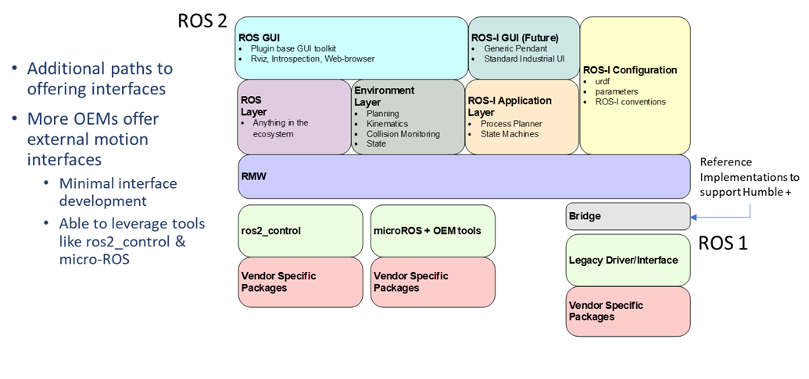

Manipulator Support in ROS 2
=============================

Supporting industrial manipulators in ROS 2 involves a modular architecture that encourages vendor participation and 
minimizes custom integration effort. Rather than relying on generic middleware or legacy systems, the ROS-Industrial 
approach promotes the use of **OEM-provided motion interfaces** that align with ROS 2 tools and conventions.

OEM Motion Interfaces as the Foundation
---------------------------------------

A growing number of OEMs now provide ROS 2-compatible external motion interfaces. These interfaces typically require 
minimal integration effort and can directly leverage the ROS 2 ecosystem, including tools such as:

- **ros2_control** – A modular and extensible framework for hardware abstraction and control
- **micro-ROS** – Lightweight ROS 2 support tailored for embedded systems and edge controllers

Examples of current OEM-supported integrations:

- **Universal Robots (UR)** – Integration through ros2_control
- **Yaskawa Motoman** – Offers MotoROS2 and micro-ROS integration since May 2023

These examples demonstrate that vendor-provided solutions offer robust, production-ready interfaces that align with 
ROS 2 control frameworks and planning pipelines.

Layered Architecture for Industrial Robot Integration
-----------------------------------------------------

The ROS-Industrial stack for manipulators is built on a layered architecture as illustrated:

- **ROS GUI Layer** – Plugin-based UI tools including RViz and browser-based interfaces
- **Environment Layer** – Tools for planning, kinematics, collision checking, and world state
- **ROS-I Application Layer** – Process planners and state machines for specific industrial workflows
- **ROS-I Configuration Layer** – Standard parameter sets and interface conventions
- **Control Layer** – Based on ros2_control, micro-ROS, or vendor-specific toolchains
- **Hardware Interface Layer** – Bridges to OEM drivers or motion libraries

This modularity allows developers and OEMs to select the integration path that best suits their hardware and capabilities.
